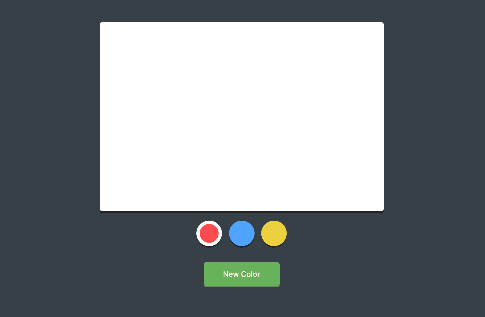

# CREATING A SIMPLE DRAWING APPLICATION
Using mouse events with jQuery to create a simple drawing application.

[Link to the live site](https://steph-blondet.github.io/drawing-application-jquery/)

Technologies Used:
- HTML
- CSS
- JavaScript
- jQuery

## Desktop View

---------
*This application was built while taking the 'jQuery Basics' lesson at Treehouse. February, 2017.
